# Supervised vs Unsupervised Learning

## What is Machine Learning

- Ability for machine to learn without explicitly being programmed
- Supervised learning used most in the real world applications

## Terminology

- Data used to train the model is called the `training set`
- `Train` the model to `learn` from the `training set` so it can `predict` another house
- `x` = input variable
  - Also called a `feature` or `input feature`
- `y` = output variable
  - Also called the `target variable` 
- `m` = number of training examples
- `(x, y)` = single training example
- To reference a specific row (x(i), y(i)) = ith training example
  - i = specific row in table
  - i is an index

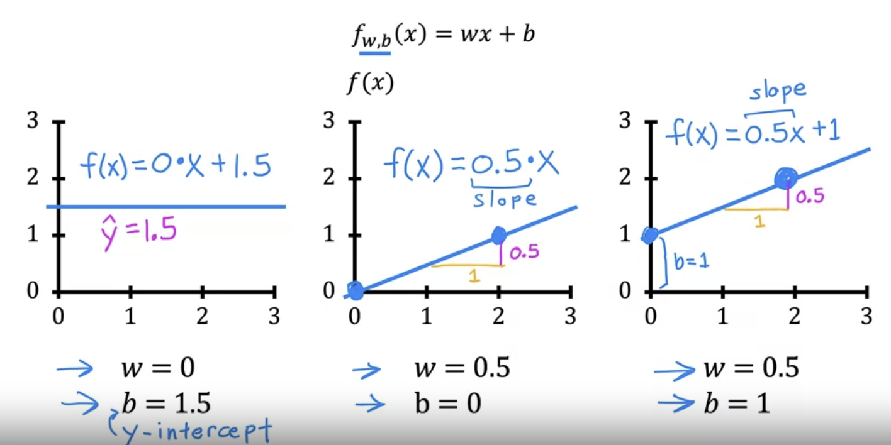

## Supervised Learning Part 1

- Most economic value created through supervised learning
- Algorithms that learn `input -> output` mappings
    - output is called the `labeled`
- Learns from being given the "right answers"
  - Is given examples that show input `x` and corresponding `output label` y
- Once it's trained, can take a brand new input and try to create the correct output
- House price prediction is a typical example of `Regression`
  - Regression = predict a number (in house price example, the price of the house would be the prediction)

## Supervised Learning Part 2

- Classification: Breast cancer detection
  - Tries to figure out if a tumor is malignant or benign
  - The output here would be benign (0) or malignant (1)
  - This is specifically *binary classification*
  - Used to predict *categories*
- Note: this is different from regression because regression tries to predict a number out of an infinite number of possibilites
  - Classification there are a set number of outcomes to be chosen from
- There can be multiple *categories* to choose from in classification
- Some terminology, *class* and *category* are used interchangeably for the output that the model produces in a classification problem

### Two or more inputs

- You can use more than 1 input value to determine the output
- Below uses age and tumor size as inputs

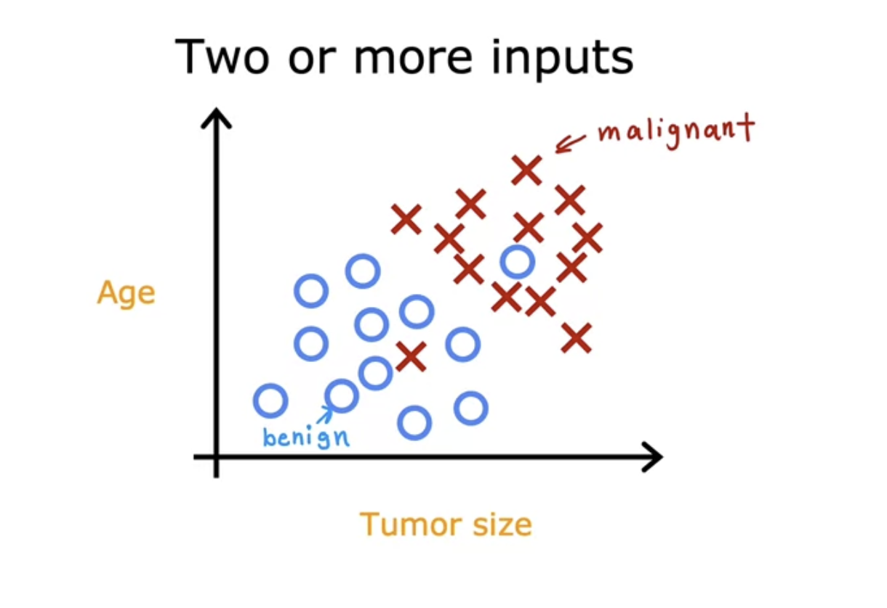

- In the below, the line is used to help decide whether a particular tumor is benign or malignant

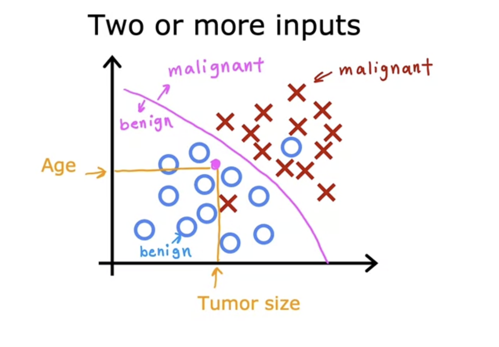

## Supervised Learning Summary

## Unsupervised Learning Part 1

- Most widely used form after supervised learning
- Given data that isn't associated with any output labels
- Find something interesting in **unlabeled** data
- Unsupervised because we're not trying to produce some "correct" output
- Your unsupervised learning might decide that your data can belong to 2 different `clusters`
  - Used in google news
    - Groups related news together

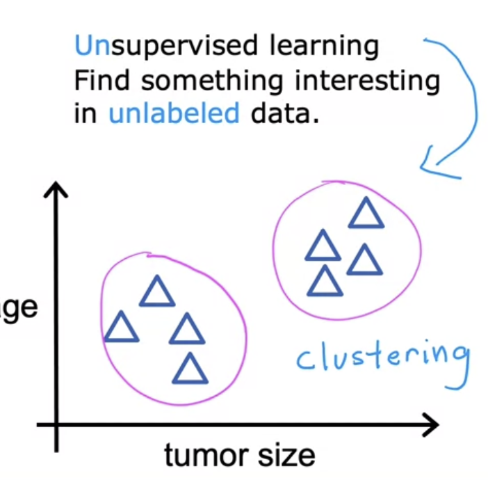

- Many businesses have huge dbs of customer data
- Group customers in different ways to better serve them and understand them

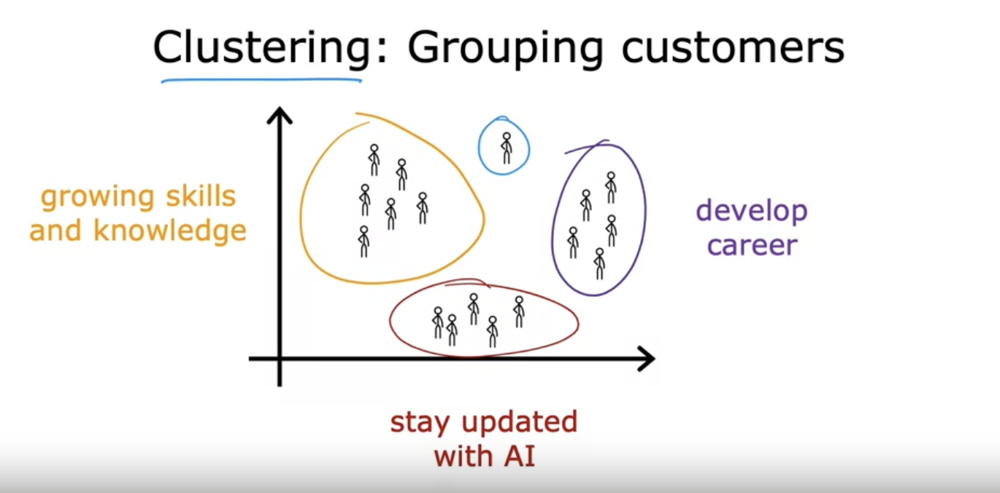

- With clustering, the unsupervised learning algorithm will try to group data points together in certain clusters

## Unsupervised Learning Part 2

- In unsupervised learning, data has only inputs x, but not output labels y
- Job is for unsupervised learning to find structure in the data
- Clustering:
  - Group similar data points together
- Anomaly detection:
  - Find unusual data points
    - Useful for fraud detection
- Dimensionality reduction
  - Compress data using fewer numbers without losing value

## Linear Regression Model Part 1

### Linear Regression with One Variable

- Linear regression just means fitting a straight line to your data
- Probably most widely used learning model
- Below uses square feet to indicate the price of the house
  - X = size in square feet
  - Y = price of house

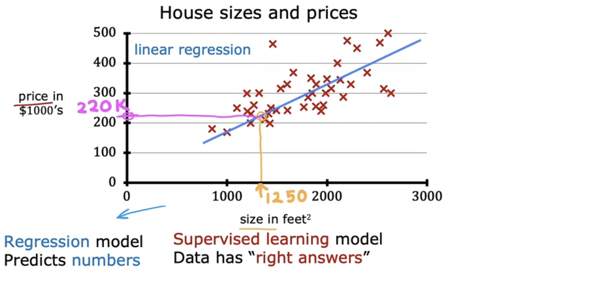

## Linear Regression Model Part 2

- Training set includes *input features* and *output targets*
- ML learning algorithm will take training set and output some output function (used to be called hypothesis)
- The job of this function is to take new data (a new set features or just one feature) and output a result
- y_hat is the prediction that the function outputs
  - Another way to say this is that y_hat is the estimate or prediction for what the real output variable y will be (which we won't know at the time for something like a house value until the house is sold)

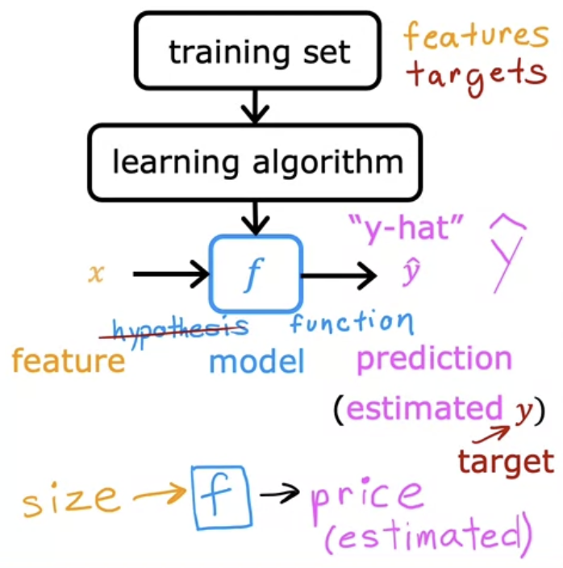

- Now how do we decide what `f` is?
- So `f` will take some input x and depending on values w and b, f will output some value as a prediction (y_hat)
  - Same as `f(x)`
- w = weight
- b = bias

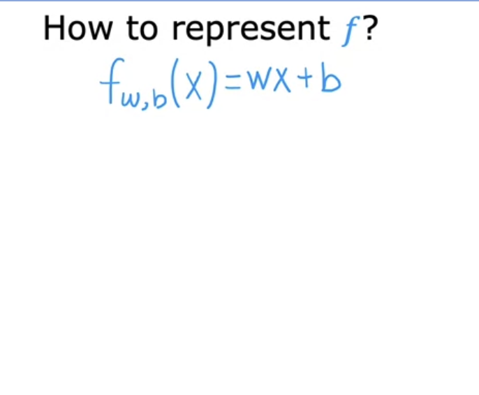

- Linear is a good way to start before going to a more complex model
- Single variable linear regression is sometimes called univariate linear regression

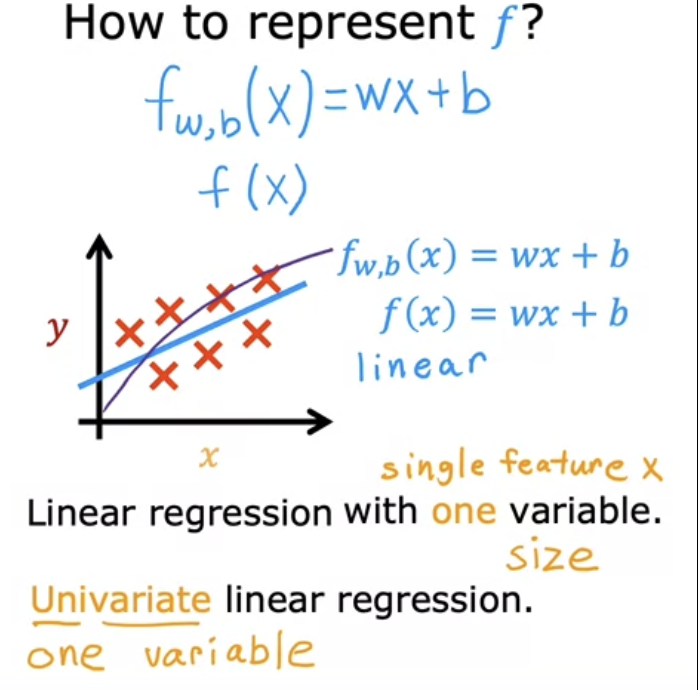

## Linear Regression with One Variable

### Cost Function

- Tells us how well the model is doing so we can try and make the model better
- `w` and `b` are called the parameters of the model
  - Parameters can be adjusted during training
  Also referred to as `coefficients` or `weights`

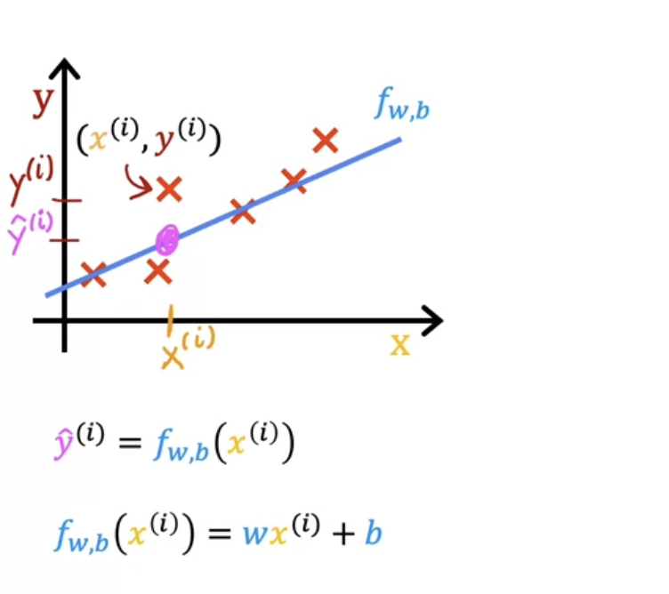

- How do we determine how well our model is doing? To answer that, we use a cost function
  - For known examples, we compare the predicted value, `y_hat` to the actual value `y`, and we do this for all examples
    - We take the square difference of `y_hat` and `y` for all training examples
    - The `1/2m` is for 2 reasons
      - `1/m` to take the average
      - The `2` is to make some of the later calculations a bit neater
        - This is optional

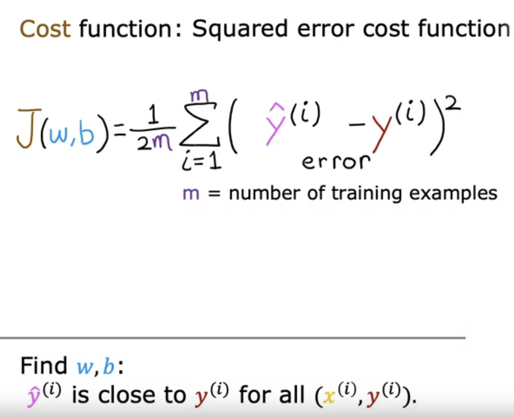