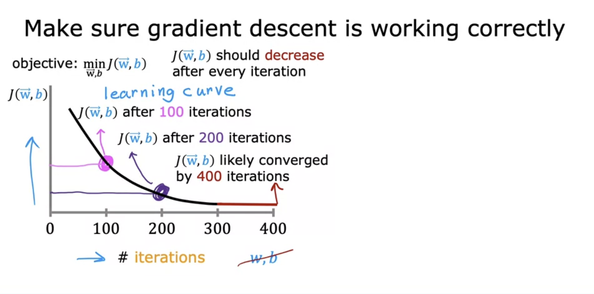
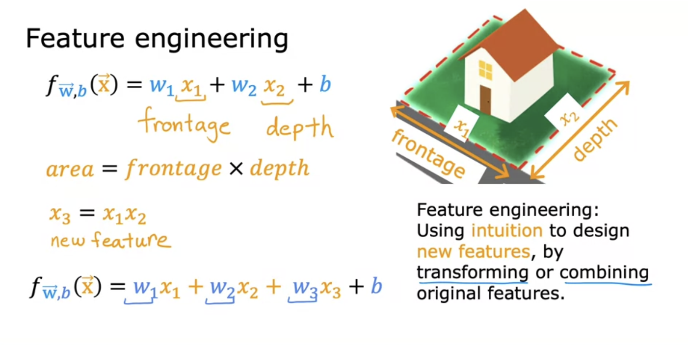
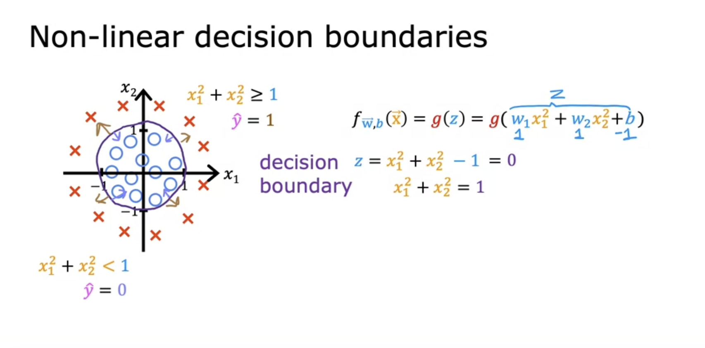
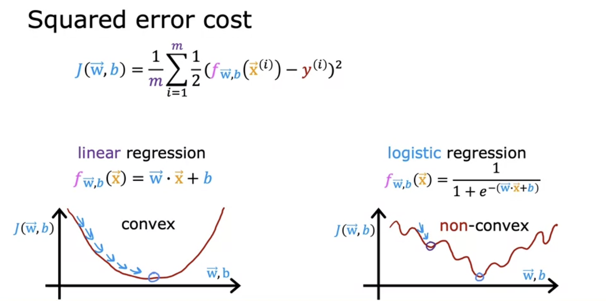
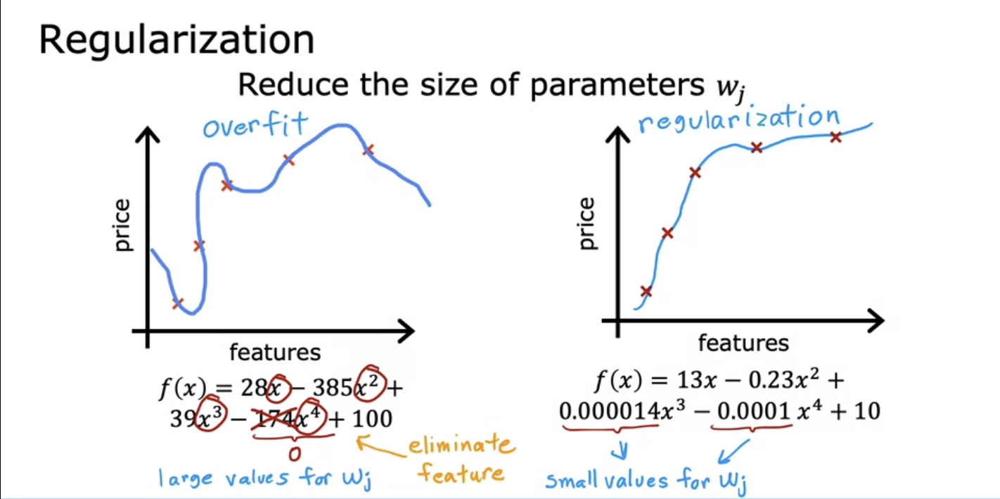

# Supervised vs Unsupervised Learning

## What is Machine Learning

- Ability for machine to learn without explicitly being programmed
- Supervised learning used most in the real world applications

## Terminology

- Data used to train the model is called the `training set`
- `Train` the model to `learn` from the `training set` so it can make a `predict` 
- `x` = input variable
  - Also called a `feature` or `input feature`
- `y` = output variable
  - Also called the `target variable` 
- `m` = number of training examples
- `(x, y)` = single training example
- To reference a specific row (x(i), y(i)) = ith training example
  - i = specific row in table
  - i is an index

## Supervised Learning Part 1

- Most economic value created through supervised learning
- Algorithms that learn `input -> output` mappings
    - output is called the `labeled`
- Learns from being given the "right answers"
  - Is given examples that show input `x` and corresponding `output label` y
- Once it's trained, can take a brand new input and try to create the correct output
- House price prediction is a typical example of `Regression`
  - Regression = predict a number (in house price example, the price of the house would be the prediction)

## Supervised Learning Part 2

- Classification: Breast cancer detection
  - Tries to figure out if a tumor is malignant or benign
  - The output here would be benign (0) or malignant (1)
  - This is specifically *binary classification*
  - Used to predict *categories*
- Note: this is different from regression because regression tries to predict a number out of an infinite number of possibilites
  - Classification there are a set number of outcomes to be chosen from
- There can be multiple *categories* to choose from in classification
- Some terminology, *class* and *category* are used interchangeably for the output that the model produces in a classification problem

### Two or more inputs

- You can use more than 1 input value to determine the output
- Below uses age and tumor size as inputs

- In the below, the line is used to help decide whether a particular tumor is benign or malignant

## Supervised Learning Summary

## Unsupervised Learning Part 1

- Most widely used form after supervised learning
- Given data that isn't associated with any output labels
- Find something interesting in **unlabeled** data
- Unsupervised because we're not trying to produce some "correct" output
- Your unsupervised learning might decide that your data can belong to 2 different `clusters`
  - Used in google news
    - Groups related news together

- Many businesses have huge dbs of customer data
- Group customers in different ways to better serve them and understand them

- With clustering, the unsupervised learning algorithm will try to group data points together in certain clusters

## Unsupervised Learning Part 2

- In unsupervised learning, data has only inputs x, but not output labels y
- Job is for unsupervised learning to find structure in the data
- Clustering:
  - Group similar data points together
- Anomaly detection:
  - Find unusual data points
    - Useful for fraud detection
- Dimensionality reduction
  - Compress data using fewer numbers without losing value

## Linear Regression Model Part 1

### Linear Regression with One Variable

- Linear regression just means fitting a straight line to your data
- Probably most widely used learning model
- Below uses square feet to indicate the price of the house
  - X = size in square feet
  - Y = price of house

## Linear Regression Model Part 2

- Training set includes *input features* and *output targets*
- ML learning algorithm will take training set and output some output function (used to be called hypothesis)
- The job of this function is to take new data (a new set features or just one feature) and output a result
- y_hat is the prediction that the function outputs
  - Another way to say this is that y_hat is the estimate or prediction for what the real output variable y will be (which we won't know at the time for something like a house value until the house is sold)

- Now how do we decide what `f` is?
- So `f` will take some input x and depending on values w and b, f will output some value as a prediction (y_hat)
  - Same as `f(x)`
- w = weight
- b = bias

- Linear is a good way to start before going to a more complex model
- Single variable linear regression is sometimes called univariate linear regression

## Linear Regression with One Variable

### Cost Function

- Tells us how well the model is doing so we can try and make the model better
- `w` and `b` are called the parameters of the model
  - Parameters can be adjusted during training
  Also referred to as `coefficients` or `weights`

- How do we determine how well our model is doing? To answer that, we use a cost function
  - For known examples, we compare the predicted value, `y_hat` to the actual value `y`, and we do this for all examples
    - We take the square difference of `y_hat` and `y` for all training examples
    - The `1/2m` is for 2 reasons
      - `1/m` to take the average
      - The `2` is to make some of the later calculations a bit neater
        - This is optional
  - This is one example, there are many more types of cost functions
    - Squared error cost is the most popular for linear regression and other types of algorithms as well

### Cost Function Intuition

- We want to minimize the cost (`J(w, b)`)
- Below is a simplified cost function where `b = 0`
- Goal: Minimize the cost function

- Below is an example where we have a perfectly fit line to our training example, `w = 1`
  - Note that the cost function is 0
- In the graph on the right had side, note that `J(1) = 0` because our cost function was 0 when `w = 1`

- Below is an exmaple where we have `w = 0.5` which is not perfectly fit

- Below is an eaxmple where we have `w = 0`

- We can keep doing this for many many values of `w`
- By continuing to do this calculation, we can create find what the cost function J looks like
  - Each value of parameter `w` corresponds to a different fitting line in f(x)
  - So for each point on the J(w) graph, you have a corresponding line for f(x)

- We want to choose `w` that minimizes `J(w)`
  - Following this example, we would choose `w = 1` because `J(w) = 0` here

### Visualizing the Cost Function

- When we have both w and b (b != 0)
  - Note that this is the 3D version of the graph we had when b = 0
- As w and b are varied, get different values for the cost function `J`
  - Any point on this graph is a particular selection of w and b

- These 3D plots can be generated as a 2D contour plot to better visualize the cost function and to see the minimum

### Visualization Examples

- Note where w and b intersect on the cost function is far from the minimum because it's not a good fit to the training set

- Another example below

- Example with cost function close to the minimum

## Training the model with Gradient Descent

### Gradient Descent

- Systematic way to minimize w and b
- Used heavily in machine learning
- Gradient descent can be used to minimize any function, not just the cost function for linear regression
- Outline
  - Start out with some initial guesses for w and b
    - Doesn't matter what initial values, commonly both are set to 0
  - Keep changing w,b to reduce J(w, b) until we settle at or near a minimum
    - J is not always a parabola with a single minimum
      - Linear regression with a cost function using squared error cost function will always be a bowl shape

- Want to get from hill to valley as fast as possible
- If I want to take a baby step and get down hill to valley as quickly as possible, what direction do we go?
  - This repeats until we hit a minimum

- What if you started in a different location?
- We may end up in a different valley
- These 2 valleys are called `local minima`

### Implementing Gradient Descent

- Update your parameter `w` by taking the *current* value of `w` and adjusting it a small amount
  - *Alpha = learning rate*
    - Small positive number between 0 and 1
    - Controls how big of a step we take downhill during gradient descent
  - Partial derivative of `J(w,b)` with respect to `w`
    - Which direction to take step
    - Also determiens size of step we take downhill (along with learning rate)
- There is a similar formula for `b`
  - Partial derivative happens with respect to `b` in this case
- Repeat these operations until we have convergence
  - This means that `w` and `b` do not change very much
- Want to update both `w` and `b` simultaneously

### Gradient descent intuition

### Learning Rate

- Has a huge impact on efficiency of your implementation
- If chosen poorly, gradient descent may not work at all

- What if you've chosen a w so that you're already at a local minimum?
  - Gradient descent will leave `w` unchanged

- As we get closer to the local minimum, the steps become smaller because the derivative is smaller leading to a smaller change in w

### Gradient Descent for Linear Regression

- Gradient descent can lead to a local minimum instead of a global minimum
- When you use a squared error cost function, there will NEVER be multiple local minimum, there is only a single global minimum
  - This is because the squared error cost function produces a bowl shaped cost function

### Running Gradient Descent

- Now we start taking steps to move to the minimum

- This gradient descent process is called `batch gradient descent`
  - `Batch` means that for each step of gradient descent uses all of the training examples for each update

## Multiple Features

- Original linear regression we had one feature

- Note that a row of features is sometimes called a `row vector`
  - A vector here is basically the same thing conceptually as an array of values
  - A row vector has all of the features values for that particular example

- Each feature will have it's own weight, so some features will contribute more to the price than the other, for example
  - Some features may DECREASE the value of the house, like price in years

- The vector weights and b are the *parameters* of the model
- We can do `vector_w * vector_x` (dot product of 2 vectors) to simplify the expression
- This is called **Multiple Linear Regression**
  - Note that this is NOT multi-variate regression (that is something else)

### Vectorization Part 1

- Makes code shorter and makes it run more efficiently
- Enables usage of things like GPUs and modern numerical linear algebra libraries
  - *Numpy* is the most popular of these numerical linear algebra libraries
- Below are 2 examples without vectorization

- With vectorization
  - Makes code shorter
  - Results in code running much faster than 2 non-vectorization implementation
    - Numpy dot function uses parallel computing to make things faster

### Vectorization Part 2

- Vectorization scales well to large datasets and modern hardware

- Below is gradient descent with vectorization

### Gradient Descent for Multiple Linear Regression

- Below is gradient descent for multiple linear regression

#### An alternative to gradient descent

- Alternative to finding w and b for multiple linear regression
- Uses the *normal equation method*
  - Works only for linear regression
- Solves all in 1 go without multiple iterations
- Slow when number of features is large
- Machine learning libraries may use this behind the scenes

### Feature Scaling Part 1

- Enables gradient descent to run much faster
- In below example, size of house has relatively large range and number of bedrooms has small range
- Actual cost of house is 500k

- When possible values of feature are small, reasonable value for parameters are relatively large
- Below shows the relationship between the range of values for a feature and what happens to changes in the weight of that feature
  - Changing the weight of w1 for square footage has a big change in the cost function
  - Larger change is required to w2 in order to change the prediction as much so large values to w2 do not change the cost function that much 

- With gradient descent, because the ovals are so tall and skinny, we may bounce back and forth before finding the minimum

- In situations like this, it's useful to *scale* the feature
  - May x1 ranges from 0 to 1 and x2 scales from 0 to 2

- To summarize, haven't different features that have very different scales can cause gradient descent to scale slowly - rescaling so all features have a comparable range of values can alleviate this issue

### Feature Scaling Part 2

- How to actually scale features
- Can divide the range by the maximum so you get ranges between 0 and 1

- Can also do *mean normalization*
- Center the values around 0
  - Typically from -1 to 1

- *Z-score normalization*
- Calculate standard deviation of each feature

- When performing feature scaling, aim for *-1 <= xj <= 1* for each feature xj

- When it doubt perform feature scaling, it's not going to cause harm

### Checking Gradient Descent for Convergence

- When running gradient descent, how can you tell if it is converging (finding global minimum of cost function)
- Job of gradient descent is to find parameters w and b that minimize the cost function *J*

- Note with the above that if there is ever an *increase* in *J* as we increase iterations, we need to test a new learning rate
  - The learning rate may be too large or there could be a bug in the code
- Note that the cost of *J* begins leveling off as interations increase
- Number of iterations for convergence can vary greatly across applications

 

- You can also use an *automatic convergence test* 
- Choosing the right value for epsilon can be difficult

### Choosing the Learning Rate

- If the learning rate is too slow, gradient descent will run very slowly
- If the learning rate  is too large, gradient descent may not converge
- Below is an example of an issue
  - Issue may be a bug in code or that learning rate is too large
    - An example could be `w1 = w1 + alpha(d1)`
      - It should be a `-` instead of a `+`
  - Bottom graph shows that we are moving away from the minimum

- To fix this, can use a smaller learning rate
  - Can try a range of values and run gradient descent for small number of iterations

### Feature Engineering

- With housing prediction, it may be better to have a single feature *area* as opposed to having that broken up between *frontage* and *depth*
  - Creating a new feature like this is called *feature engineering*
    - Usually done by transforming or combining the original features
    - This can result in a better model

### Polynomial Regression

- Nonlinear functions for data
  - Quadratic function
  - Cubic function
  - Etc...

- If we have features that are squared or cubed, feature scaling becomes more important so we have features into comparable ranges of values

- *How to decide what features to use*
  - Comes later in the course

 

- When running gradient descent, it will help pick the "correct" features for you
  - The less weight a feature has, the less important it is
- Imagine we have a formula like
  - w0x0 + w1x1^2 + w2x2^3 + b
  - After gradient descent if
    - w0 = 0.08
    - w1 = 0.54
    - w2 = 0.03
    - b = 0.0106
    - Weight of w1 much greater than w2

## Classification

- Output variable value can take on 1 of a small range of values
  - Class and category are used interchangeably 

- Example for training set for malignant tumor
  - If you tried to use linear regression here, it can be any possible real number - not just 0 or 1
  - Could try and use a threshold to decide what becomes 0 and what becomes 1

- Now if a new `x` is added, it will shift the line and shifts what we identify as 0 or 1
  - We now have `x`'s that are misidentified
    - `Decision boundary` is now in a bad location

- *Logistic Regression* is used for classification problems and removes these issues

### Logistic Regression

- Continuing example of determining if a tumor is malignant
- Logistic regression will fit a curve to this data better
  - It's more of an `S` curve

- Algorithm will use a *threshold* to determine if the tumor is malignant or not
- *Sigmoid function* (aka logistic function) is very commonly used in logistic regression
  - Outputs values between 0 and 1

- When `z` is a very large positive number, `G(x) = 1` (approximately)
- When `z` is very small (large negative number), `G(z) = 0` (approximately)

 

- Below is logistic regression formula
  - Inputs feature or set of features and it outputs a value between 0 and 1

- Outputs *probability* that the class is *1*
- Example
  - x = tumor size
  - y = 0 (not malignant)
  - y = 1 (malignant)
  - value is 0.7 which means there is a 70% chance that the tumor is malignant
    - 30% chance it is not malignant then

### Decision Boundary

- May set a threshold where value above is 1 and below is 0
- Below is an example when the threshold is 0.5

- Below is an example of the decision boundary with two features x1 and x2
  - w1 = 1
  - w2 = 1
  - b = -3

- What about non-linear decision boundaries
- Can use polynomials in logistic regression just like we did in linear regression

- Decision boundaries can be much more complicated

### Cost function for logistic regression

- The cost function gives you a way to measure how well a specific set of parameters fit the the training data
  - Gives way to choose better parameters
- Squared error cost function is not ideal for logistic regression
- Give training set, how can we choose parameters *w* and *b*

- For linear regression, we used the *squared cost function*
- With logistic regression, there are lots of local minimums if we use the squared error cost function

- *Loss function* measures how well you are doing on one training example
  - So *cost function* is a summation of the *loss* function

 

- Below is an example of what happens to Loss as f(x) -> 1 and f(x) -> 0 when y^(i) = 1
  - As f(x) -> 1, loss approaches 0
    - The tumor is malignant, so as our prediction gets closer to 1, loss gets closer to 0 (0 means no loss)
    - If the tumor is malignant, as our prediction gets closer to 0, loss gets closer to 1 (1 meaning completely wrong)
    - 

- Next is an example when y^(i) = 0

 

- Cost function for logistic regression

### Simplified Cost Function for Logistic Regression

- There is a simplified loss function (and cost function) that exists for binary classification problems where `y` can only be 0 or 1
- Below is the simplified loss function and the logic to get to that

- Below is the simplified cost function using the simplified loss function

### Gradient Descent Implementation

- How to find *w* and *b*
- Below is general gradient descent approach

- This looks just like linear regression, but remember f(x) itself is a different function

- Just like with linear regression: 
  - Want to monitor gradient descent (learning curve)
  - Use a vectorized implementation to improve speed
  - Use feature scaling if needed

## The Problem of Overfitting

- Sometimes our learning algorithm can run into *overfitting*
- Underfit means algorithm does not fit training set well - it has *high bias*
- *Generalization* means that the algorithm does fit the training set well and would predict a new unseen value fairly accurately
- Overfit means the algorithm has fit the training set too well - it has *high variance*
  - You can even have a 0 cost function because we're fitting the data perfectly
  - If the training sets were just a little bit differently, the the function that the algorithm fits could be totally different and therefore the algorithm could make totally different predictions
    - This is what we mean when we say *high variance*

- We want to find a model that generalizes well - shouldn't overfit or underfit
- These same problems exist for classification problem as well

### Addressing Overfitting

- Collecting more training examples 
  - Can make your overfitting algorithm end up working pretty well

- Select features to include/exclude to reduce overfitting - *feature selection*
  - Having a lot of features without many training examples can lead to overfitting
  - Disadvantage, by only using some features, we're throwing away some information that may be useful
    - There are tools that will automatically choose the most useful features to use

- Regularization is a way to keep all features and prevents features from having an overly large effect on the algorithm (which usually is what causes overfitting)
  - Usually w values are regularized and b isn't
  - This is commonly used with neural networks

### Cost Function with Regularization

- Basically what we are doing with the below since we have 1000 multipled to w3^2 and w4^2, we need to have very small values for w3 and w4 so that we minimize the cost
  - We *regularized* w3 and w4

- If you have a lot of features, you may not know which are the most important ones and which to penalize
- So you penalize all the features (all the wj) parameters which leads to the model being less prone to overfitting
- Lambda is the *regularization parameter*

- In this modified cost function, we want to minimize the original cost and the regularization term
  - Minimizing cost is for fitting the data
  - Regularization term is to keep wj small to reduce overfitting
  - Labmda is used to balance between these 2 goals
- If labmda is 0, model will overfit
- If labmda huge, model will underfit

### Regularized Linear Regression

- Below shows linear regression and the new formulas with regularization

 